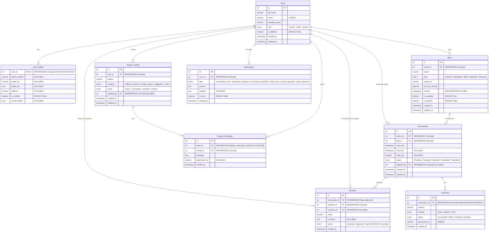

```mermaid
erDiagram
    Users {
        int id PK
        varchar full_name
        varchar email "UNIQUE"
        varchar password_hash
        enum role "('owner', 'renter', 'admin')"
        boolean is_deleted "DEFAULT false"
        timestamp created_at
        timestamp updated_at
    }
    User_Profiles {
        int user_id PK, FK "REFERENCES Users(id) ON DELETE CASCADE"
        varchar phone_number "NULLABLE"
        varchar avatar_url "NULLABLE"
        text public_bio "NULLABLE"
        varchar address "NULLABLE"
        boolean is_verified "DEFAULT false"
        json custom_fields "NULLABLE"
    }
    Bikes {
        int id PK
        int owner_id FK "REFERENCES Users(id)"
        varchar model
        enum type "('Urbana', 'Montañera', 'BMX', 'Deportiva', 'Eléctrica')"
        varchar image_url
        decimal cost_per_minute
        geography location "GEOGRAPHY(Point, 4326)"
        boolean is_available "DEFAULT true"
        boolean is_deleted "DEFAULT false"
        timestamp created_at
        timestamp updated_at
    }
    Reservations {
        int id PK
        int renter_id FK "REFERENCES Users(id)"
        int bike_id FK "REFERENCES Bikes(id)"
        timestamp start_time
        timestamp end_time "NULLABLE"
        decimal total_cost "NULLABLE"
        enum status "('Pending', 'Accepted', 'Declined', 'Completed', 'Cancelled')"
        int updated_by FK "REFERENCES Users(id) NULLABLE"
        timestamp created_at
        timestamp updated_at
    }
    Reviews {
        int id PK
        int reservation_id FK "REFERENCES Reservations(id)"
        int reviewer_id FK "REFERENCES Users(id)"
        int reviewee_id FK "REFERENCES Users(id)"
        decimal rating
        text comment "NULLABLE"
        enum status "('pending', 'approved', 'rejected') DEFAULT 'pending'"
        timestamp created_at
    }
    Payments {
        int id PK
        int reservation_id FK "REFERENCES Reservations(id) ON DELETE RESTRICT"
        decimal amount
        enum method "('yape', 'paypal', 'card')"
        enum status "('succeeded', 'failed', 'refunded', 'pending')"
        varchar transaction_id "UNIQUE"
        timestamp created_at
    }
    Support_Tickets {
        int id PK
        int user_id FK "REFERENCES Users(id)"
        varchar subject
        enum category "('billing', 'technical', 'incident_report', 'suggestion', 'other')"
        enum status "('open', 'in_progress', 'resolved', 'closed')"
        int updated_by FK "REFERENCES Users(id) NULLABLE"
        timestamp created_at
        timestamp updated_at
    }
    Support_Messages {
        int id PK
        int ticket_id FK "REFERENCES Support_Tickets(id) ON DELETE CASCADE"
        int sender_id FK "REFERENCES Users(id)"
        text message
        varchar attachment_url "NULLABLE"
        timestamp created_at
    }
    Notifications {
        int id PK
        int user_id FK "REFERENCES Users(id)"
        enum type "('reservation_new', 'reservation_accepted', 'reservation_cancelled', 'review_new', 'review_approved', 'ticket_response')"
        text content
        json payload "NULLABLE"
        boolean is_read "DEFAULT false"
        timestamp created_at
    }
    Users ||--|{ User_Profiles : "has"
    Users ||--o{ Bikes : "owns"
    Users ||--o{ Reservations : "makes (as renter)"
    Users ||--o{ Support_Tickets : "creates"
    Users ||--o{ Reviews : "writes (as reviewer)"
    Users ||--o{ Reviews : "is reviewed (as reviewee)"
    Bikes ||--o{ Reservations : "is reserved in"
    Reservations ||--o{ Reviews : "can have"
    Reservations ||--o{ Payments : "has"
    Support_Tickets ||--o{ Support_Messages : "has"
    Users ||--o{ Support_Messages : "sends"
    Users ||--o{ Notifications : "receives"
```
